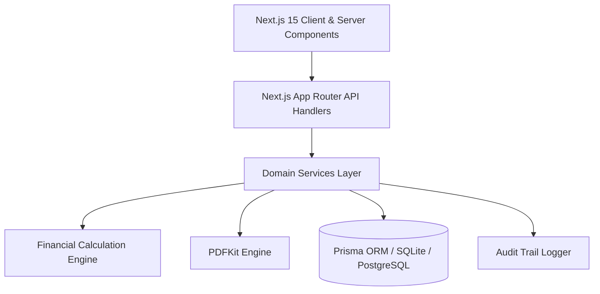

# 🧾 Enterprise Invoice Generator

[](https://nextjs.org/)
[](https://react.dev/)
[](https://www.typescriptlang.org/)
[](https://tailwindcss.com/)
[](https://www.prisma.io/)
[](https://opensource.org/licenses/MIT)

An enterprise-grade, full-stack **Invoice & Billing Management Platform** built with **Next.js 15 (App Router)**, **React 19**, **TypeScript**, **Tailwind CSS v4**, and **Prisma ORM**. Features automated recurring invoicing, sub-cent exact financial calculations, multi-currency conversion, automated reminder scheduling, credit note issuance, server-side PDF generation via PDFKit, and financial analytics.

---

## 📑 Table of Contents

- [✨ Key Features](#-key-features)
- [🏗️ System Architecture](#️-system-architecture)
- [💻 Tech Stack](#-tech-stack)
- [📁 Project Structure](#-project-structure)
- [🚀 Quick Start](#-quick-start)
- [📜 Available Scripts](#-available-scripts)
- [🧮 Financial Precision Engine](#-financial-precision-engine)
- [🔌 API Endpoints](#-api-endpoints)
- [🛡️ Audit Logging & Security](#️-audit-logging--security)
- [🤝 Contributing](#-contributing)
- [📄 License](#-license)

---

## ✨ Key Features

### 📄 Invoicing Lifecycle
- **Complete Invoice Operations**: Create, edit, preview, duplicate, send, mark paid/partially paid, void, and delete invoices.
- **Custom Sequential Numbering**: Configurable invoice numbering formats (e.g. `INV-{YEAR}-{SEQ}`) with configurable sequence padding.
- **Dynamic Status Lifecycle**: Automatic status transitions across `DRAFT` ➔ `SENT` ➔ `VIEWED` ➔ `PARTIALLY_PAID` ➔ `PAID` ➔ `OVERDUE` ➔ `VOID`.
- **Custom Line Items & Discounts**: Supports product catalog linking or custom line items, per-item or global percentage & fixed discounts, and item-level tax overrides.

### 💳 Payments & Credit Notes
- **Multi-Method Payment Recording**: Track transactions via Cash, Bank Transfer, Credit/Debit Card, Cheque, or Online Payment Gateways with reference tracking.
- **Credit Note Management**: Issue full or partial credit notes linked directly to parent invoices, automatically updating balance and status.

### 🔄 Recurring Profiles & Automation
- **Automated Recurring Invoices**: Configure recurring billing schedules (Weekly, Monthly, Quarterly, Annually, or Custom Day intervals).
- **Auto-Generation & Dispatch**: Background processor generates draft or auto-sent invoices when cycles come due.
- **Cycle Limits**: Support for fixed cycle counts or specific end dates.

### 💱 Multi-Currency & Foreign Exchange (FX)
- **Multi-Currency Invoicing**: Invoice clients in their native currency with real-time base currency conversions.
- **FX Snapshotting**: Exchange rates are locked at invoice creation time to protect against financial discrepancies.
- **Curated Rate Matrix**: Easily maintain exchange rates across USD, EUR, GBP, CAD, AUD, JPY, and more.

### 🔔 Automated Reminders & Communication
- **Scheduled Reminder Triggers**:
  - 3 days before due date (`BEFORE_DUE_3`)
  - On due date (`ON_DUE`)
  - 7, 14, and 30 days overdue (`OVERDUE_7`, `OVERDUE_14`, `OVERDUE_30`)
  - Ad-hoc custom reminders
- **Multi-Channel Dispatch**: Support for Email and SMS delivery templates with dynamic invoice token substitution.

### 🖨️ Server-Side PDF Generation
- **High-Performance Vector PDFs**: Built with PDFKit for server-side generation of invoices, receipts, and payment vouchers.
- **Custom Branding**: Entity legal name, tax IDs, bank details, customizable primary color theme, notes, terms, and clean itemized breakdowns.

### 📊 Reports & Financial Analytics
- **Accounts Receivable Aging**: Breakdown of current, 1–30 days, 31–60 days, 61–90 days, and 90+ days overdue balances.
- **Revenue & Tax Summaries**: Monthly revenue trends, inclusive/exclusive tax breakdown, client collection rates, and average days to payment.

---

## 🏗️ System Architecture



---

## 💻 Tech Stack

| Category | Technology |
|---|---|
| **Framework** | [Next.js 15](https://nextjs.org/) (App Router & Server Actions) |
| **Frontend Library** | [React 19](https://react.dev/) |
| **Language** | [TypeScript 5.7](https://www.typescriptlang.org/) |
| **Styling** | [Tailwind CSS v4](https://tailwindcss.com/) |
| **Database & ORM** | [Prisma 6.3](https://www.prisma.io/) (SQLite default, PostgreSQL/MySQL ready) |
| **PDF Generation** | [PDFKit](https://pdfkit.org/) |
| **Icons** | [Lucide React](https://lucide.dev/) |
| **Schema Validation**| [Zod](https://zod.dev/) |

---

## 📁 Project Structure

```text
├── prisma/
│   ├── schema.prisma       # Database schema (Entities, Invoices, Clients, Products, Payments, etc.)
│   └── seed.js             # Demo data seeder for entities, clients, products, tax rates & FX
├── scripts/
│   └── verify-money.ts     # Verification suite for financial arithmetic & calculations
├── src/
│   ├── app/
│   │   ├── api/            # REST API endpoints (Invoices, Clients, Products, Payments, PDF, etc.)
│   │   ├── audit-log/      # Audit log activity viewer
│   │   ├── clients/        # Client directory & management
│   │   ├── invoices/       # Invoice builder, listing, editor, & preview
│   │   ├── products/       # Product and service catalog
│   │   ├── recurring/      # Recurring billing profiles
│   │   ├── reminders/      # Automated reminder scheduler & dispatch
│   │   ├── reports/        # Financial analytics, revenue & aging reports
│   │   ├── settings/       # Organization & company settings
│   │   ├── tax-fx/         # Tax rates & foreign exchange rates
│   │   ├── layout.tsx      # App shell layout with sidebar navigation
│   │   └── page.tsx        # Executive dashboard with KPI metrics
│   ├── components/
│   │   ├── InvoiceForm.tsx # Interactive invoice editor & line-item calculator
│   │   ├── Sidebar.tsx     # Navigation sidebar
│   │   ├── SimpleCrud.tsx  # Generic CRUD modal component
│   │   └── ui.tsx          # Reusable UI primitives (Buttons, Cards, Badges, Modals)
│   └── lib/
│       ├── money.ts        # Cent-based financial calculations & tax distributions
│       ├── prisma.ts       # Singleton Prisma client instance
│       ├── types.ts        # TypeScript schemas & DTO types
│       └── services/       # Domain business logic (Invoices, PDF, FX, Reminders, Reports)
└── package.json
```

---

## 🚀 Quick Start

### Prerequisites
- [Node.js](https://nodejs.org/) (v18.18+ or v20+ recommended)
- [npm](https://www.npmjs.com/) or [pnpm](https://pnpm.io/)

### Installation

1. **Clone the repository:**
   ```bash
   git clone https://github.com/abidali72/Invoice-generator.git
   cd Invoice-generator
   ```

2. **Install dependencies:**
   ```bash
   npm install
   ```

3. **Initialize Database & Seed Demo Data:**
   ```bash
   npm run setup
   ```
   *This creates the database schema using Prisma and populates initial demo entities, clients, products, tax rates, and exchange rates.*

4. **Start the Development Server:**
   ```bash
   npm run dev
   ```

5. **Open Application:**
   Visit [http://localhost:3000](http://localhost:3000) in your browser.

---

## 📜 Available Scripts

| Command | Description |
|---|---|
| `npm run dev` | Starts the Next.js development server at `http://localhost:3000` |
| `npm run build` | Builds optimized production bundle |
| `npm run start` | Runs the production build |
| `npm run setup` | Applies Prisma migrations and seeds sample data |
| `npm run db:push` | Pushes the Prisma schema to the database |
| `npm run db:seed` | Populates database with default fixtures and rates |

---

## 🧮 Financial Precision Engine

To prevent floating-point inaccuracies common in financial applications, this platform utilizes an **integer-cent arithmetic engine** (`src/lib/money.ts`):

- **Integer Storage**: All monetary values are calculated and stored in integer cents (e.g., `$10.50` = `1050` cents).
- **Proportional Discount Allocation**: Global discounts are distributed across line items using Largest Remainder algorithms to ensure line items sum exactly to the subtotal.
- **Tax Calculations**: Supports both **Inclusive** and **Exclusive** compounding tax models with deterministic rounding:
  $$\text{Exclusive Tax} = \text{round}\left(\text{Net} \times \frac{\text{Rate}}{100}\right)$$
  $$\text{Inclusive Tax} = \text{round}\left(\text{Gross} - \frac{\text{Gross}}{1 + \frac{\text{Rate}}{100}}\right)$$

---

## 🔌 API Endpoints

| Resource | Route | Method | Description |
|---|---|---|---|
| **Invoices** | `/api/invoices` | `GET`, `POST` | List invoices or create a new invoice |
| **Invoice Detail** | `/api/invoices/[id]` | `GET`, `PUT`, `DELETE` | Retrieve, update, or delete invoice |
| **PDF Generation** | `/api/invoices/[id]/pdf` | `GET` | Stream server-generated PDF |
| **Payments** | `/api/invoices/[id]/payments` | `POST` | Record payment against invoice |
| **Credit Notes** | `/api/invoices/[id]/credit-notes` | `POST` | Issue credit note |
| **Clients** | `/api/clients` | `GET`, `POST`, `PUT`, `DELETE` | Manage customer records |
| **Products** | `/api/products` | `GET`, `POST`, `PUT`, `DELETE` | Manage catalog items & pricing |
| **Tax Rates** | `/api/tax-rates` | `GET`, `POST`, `PUT`, `DELETE` | Configure tax rates |
| **Exchange Rates** | `/api/currency-rates` | `GET`, `POST`, `PUT` | Currency FX management |
| **Recurring** | `/api/recurring-profiles` | `GET`, `POST`, `PUT`, `DELETE` | Recurring billing profiles |
| **Reminders** | `/api/reminders` | `GET`, `POST` | Reminder triggers & dispatch |
| **Reports** | `/api/reports/aging` | `GET` | Accounts Receivable Aging breakdown |
| **Audit Logs** | `/api/audit-logs` | `GET` | System activity and change history |

---

## 🛡️ Audit Logging & Security

Every mutation across the application triggers an immutable audit log record capturing:
- **Entity Type & ID** (`INVOICE`, `CLIENT`, `PAYMENT`, etc.)
- **Action Type** (`CREATE`, `UPDATE`, `SEND`, `VOID`, `PAYMENT_RECORDED`)
- **Actor Identification & Timestamp**
- **JSON Changeset Diff** for audit traceability

---

## 🤝 Contributing

Contributions are welcome! To contribute:
1. Fork the Project
2. Create your Feature Branch (`git checkout -b feature/AmazingFeature`)
3. Commit your Changes (`git commit -m 'Add some AmazingFeature'`)
4. Push to the Branch (`git push origin feature/AmazingFeature`)
5. Open a Pull Request

---

## 📄 License

Distributed under the **MIT License**. See `LICENSE` for more information.

---

<div align="center">
  <sub>Built with ❤️ by <a href="https://github.com/abidali72">abidali72</a></sub>
</div>
